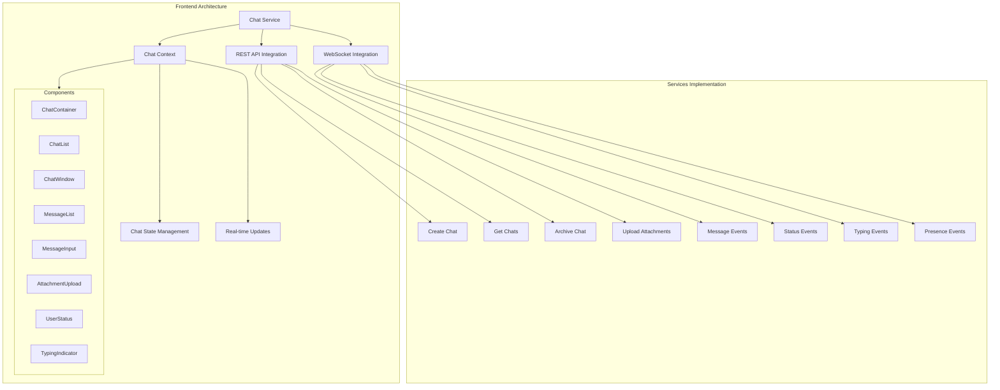

# Chat Implementation Plan

## Overview
This document outlines the implementation plan for integrating chat functionality into the Care Sync Unity application, following the specifications in the chat-integration-guide.md.

## Architecture



## Implementation Details

### 1. Service Layer Implementation
Location: `src/services/chat.js`

#### REST API Integration
- Create chat (direct/group)
- Get user's chats
- Get chat by ID
- Archive chat
- Upload attachments

#### WebSocket Integration
- Connection management
- Event handling
- Reconnection logic
- Error handling

### 2. State Management
Location: `src/context/ChatContext.jsx`

- Chat list management
- Active chat state
- Real-time updates handling
- Message status tracking
- User presence management
- Typing indicators state

### 3. Component Structure
Location: `src/features/chat/`

```
src/features/chat/
├── components/
│   ├── ChatContainer.jsx    (Main chat layout)
│   ├── ChatList.jsx         (List of available chats)
│   ├── ChatWindow.jsx       (Active chat display)
│   ├── MessageList.jsx      (Chat messages)
│   ├── MessageInput.jsx     (Message composition)
│   ├── AttachmentUpload.jsx (File upload)
│   ├── UserStatus.jsx       (Online/offline indicator)
│   └── TypingIndicator.jsx  (Typing status)
└── hooks/
    ├── useChat.js           (Chat management hook)
    ├── useWebSocket.js      (WebSocket connection hook)
    └── useTyping.js         (Typing indicator hook)
```

## Implementation Phases

### Phase 1: Core Infrastructure
- Set up chat service with basic API integration
- Implement WebSocket connection management
- Create ChatContext and provider
- Basic error handling setup

### Phase 2: Basic Messaging
- Implement chat list and chat window components
- Basic message sending and receiving
- Message history display
- Error state handling and user feedback

### Phase 3: Advanced Features
- File attachment upload and display
- User presence tracking
- Typing indicators
- Message read receipts
- Group chat functionality

### Phase 4: Polish & Optimization
- Enhance error handling
- Add loading states and placeholders
- Optimize performance
  - Message pagination
  - Image lazy loading
  - WebSocket reconnection strategy
- UI/UX refinements
  - Smooth animations
  - Responsive design
  - Accessibility improvements

## Best Practices & Considerations

### Error Handling
- Implement comprehensive error handling for API calls
- Handle WebSocket connection issues gracefully
- Show appropriate error messages to users
- Implement retry mechanisms for failed operations

### Performance
- Implement message pagination
- Optimize attachment handling
- Use WebSocket heartbeat for connection management
- Cache chat history appropriately

### User Experience
- Show loading states during operations
- Implement optimistic updates
- Provide clear feedback for user actions
- Handle offline scenarios gracefully

### Security
- Validate data before sending
- Sanitize received messages
- Handle attachments securely
- Implement proper authentication checks